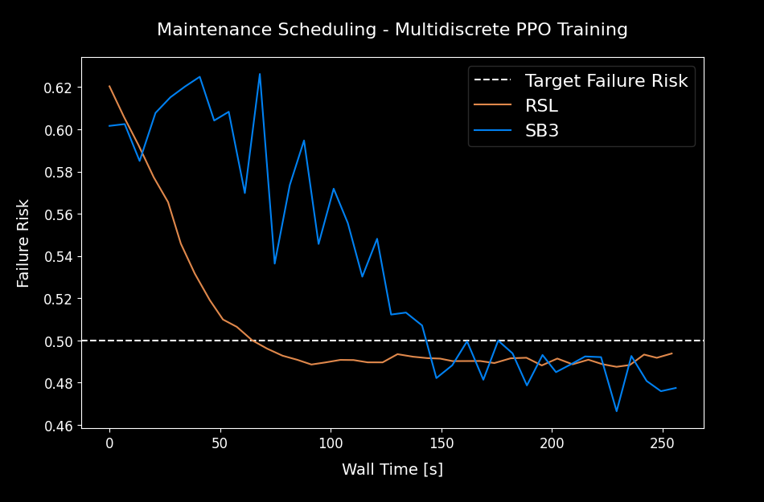
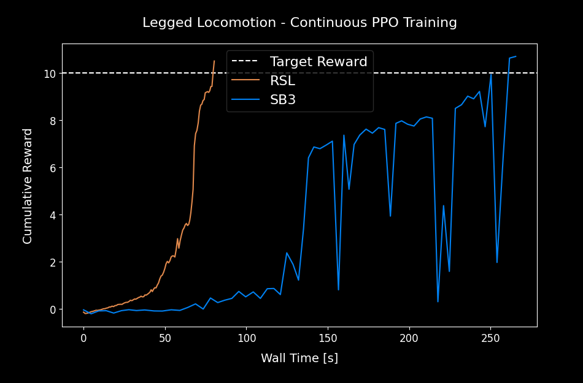
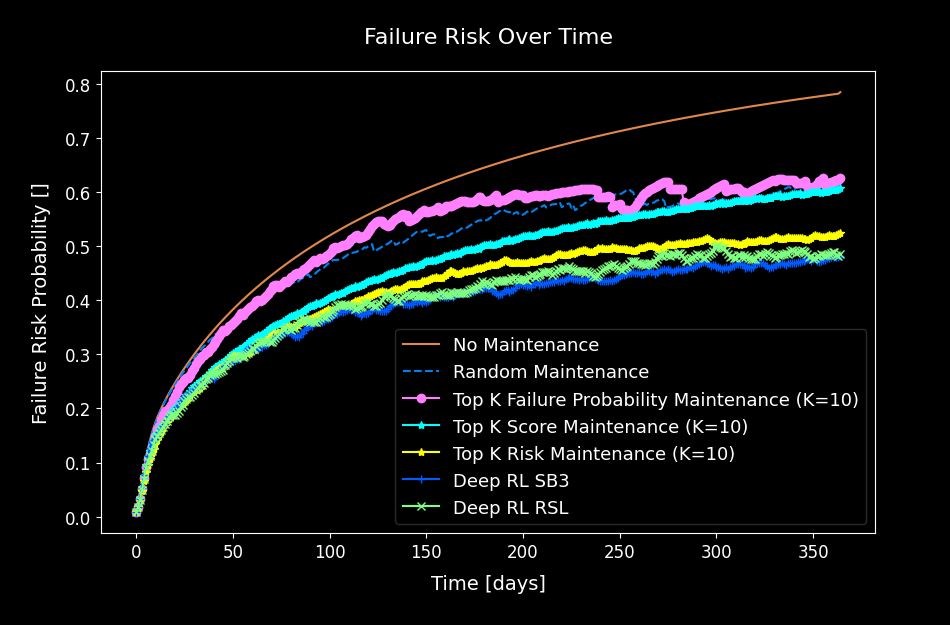
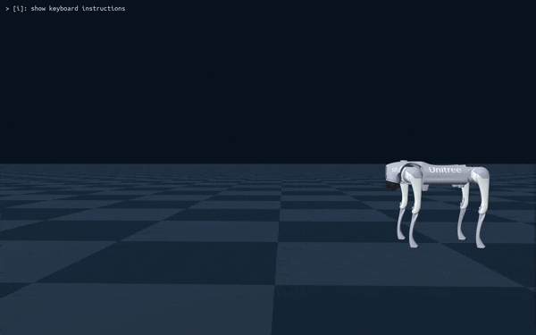
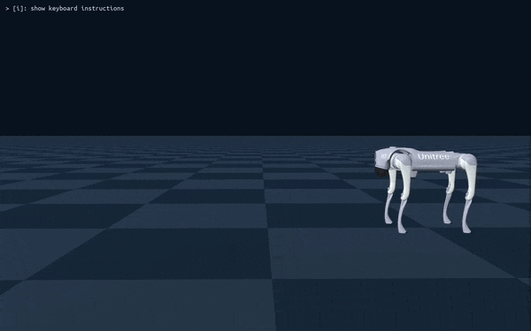

<table>
  <tr>
    <td width="50%"></td>
    <td width="50%"></td>
  </tr>
  <tr>
    <td align="center">MultiDiscrete Training Curve RSL VS SB3</td>
    <td align="center">Continuous Training Curve RSL VS SB3</td>
  </tr>
</table>
# Discrete RSL RL

Customized version of the original [RSL RL project](https://github.com/leggedrobotics/rsl_rl) that additionally supports multi discrete action spaces, providing a fast and simple implementation of PPO algorithm, designed to run fully on GPU.

## Environment Configuration

```bash
conda create -n rsl_rl python=3.11
conda activate rsl_rl
pip install -r requirements
```

## Examples

### Multi Discrete Action Space - Maintenance Scheduling Optimization

```bash
python training_rsl_multidiscrete.py # RSL Training
python training_sb3_multidiscrete.py # Stable Baselines 3 Training
```

```bash
python evaluate_multidiscrete.py
```

<table>
  <tr>
    <td width="50%"></td>
    <td width="50%"></td>
  </tr>
  <tr>
    <td align="center">MultiDiscrete Training Curve RSL VS SB3</td>
    <td align="center">Trained Model Evaluation</td>
  </tr>
</table>

### Continuous Action Space - Robotics Legged Locomotion

```bash
python training_rsl_continuous.py # RSL Training
python training_sb3_continuous.py # Stable Baselines 3 Training
```

```bash
python evaluate_continuous.py
```

<table>
  <tr>
    <td width="33%"></td>
    <td width="33%"></td>
    <td width="33%"></td>
  </tr>
  <tr>
    <td width="33%" align="center">MultiDiscrete Training Curve RSL VS SB3</td>
    <td width="33%" align="center">Trained Model Evaluation - RSL</td>
    <td width="33%" align="center">Trained Model Evaluation - SB3</td>
  </tr>
</table>

### Tensorboard Visualization

```bash
tensorboard --logdir runs/
```

# Citation
```
@misc{palmas2024discrete_rsl_rl,
  author = {Alessandro Palmas},
  title = {Discrete RSL RL},
  year = {2025},
  url = {https://github.com/alexpalms/discrete_rsl_rl},
  note = {GitHub repository}
}
```

# RSL RL (Original Readme)

A fast and simple implementation of RL algorithms, designed to run fully on GPU.
This code is an evolution of `rl-pytorch` provided with NVIDIA's Isaac Gym.

Environment repositories using the framework:

* **`Isaac Lab`** (built on top of NVIDIA Isaac Sim): https://github.com/isaac-sim/IsaacLab
* **`Legged-Gym`** (built on top of NVIDIA Isaac Gym): https://leggedrobotics.github.io/legged_gym/

The main branch supports **PPO** and **Student-Teacher Distillation** with additional features from our research. These include:

* [Random Network Distillation (RND)](https://proceedings.mlr.press/v229/schwarke23a.html) - Encourages exploration by adding
  a curiosity driven intrinsic reward.
* [Symmetry-based Augmentation](https://arxiv.org/abs/2403.04359) - Makes the learned behaviors more symmetrical.

We welcome contributions from the community. Please check our contribution guidelines for more
information.

**Maintainer**: Mayank Mittal and Clemens Schwarke <br/>
**Affiliation**: Robotic Systems Lab, ETH Zurich & NVIDIA <br/>
**Contact**: cschwarke@ethz.ch

> **Note:** The `algorithms` branch supports additional algorithms (SAC, DDPG, DSAC, and more). However, it isn't currently actively maintained.


## Setup

The package can be installed via PyPI with:

```bash
pip install rsl-rl-lib
```

or by cloning this repository and installing it with:

```bash
git clone https://github.com/leggedrobotics/rsl_rl
cd rsl_rl
pip install -e .
```

The package supports the following logging frameworks which can be configured through `logger`:

* Tensorboard: https://www.tensorflow.org/tensorboard/
* Weights & Biases: https://wandb.ai/site
* Neptune: https://docs.neptune.ai/

For a demo configuration of PPO, please check the [example_config.yaml](config/example_config.yaml) file.


## Contribution Guidelines

For documentation, we adopt the [Google Style Guide](https://sphinxcontrib-napoleon.readthedocs.io/en/latest/example_google.html) for docstrings. Please make sure that your code is well-documented and follows the guidelines.

We use the following tools for maintaining code quality:

- [pre-commit](https://pre-commit.com/): Runs a list of formatters and linters over the codebase.
- [black](https://black.readthedocs.io/en/stable/): The uncompromising code formatter.
- [flake8](https://flake8.pycqa.org/en/latest/): A wrapper around PyFlakes, pycodestyle, and McCabe complexity checker.

Please check [here](https://pre-commit.com/#install) for instructions to set these up. To run over the entire repository, please execute the following command in the terminal:

```bash
# for installation (only once)
pre-commit install
# for running
pre-commit run --all-files
```

## Citing

**We are working on writing a white paper for this library.** Until then, please cite the following work
if you use this library for your research:

```text
@InProceedings{rudin2022learning,
  title = 	 {Learning to Walk in Minutes Using Massively Parallel Deep Reinforcement Learning},
  author =       {Rudin, Nikita and Hoeller, David and Reist, Philipp and Hutter, Marco},
  booktitle = 	 {Proceedings of the 5th Conference on Robot Learning},
  pages = 	 {91--100},
  year = 	 {2022},
  volume = 	 {164},
  series = 	 {Proceedings of Machine Learning Research},
  publisher =    {PMLR},
  url = 	 {https://proceedings.mlr.press/v164/rudin22a.html},
}
```

If you use the library with curiosity-driven exploration (random network distillation), please cite:

```text
@InProceedings{schwarke2023curiosity,
  title = 	 {Curiosity-Driven Learning of Joint Locomotion and Manipulation Tasks},
  author =       {Schwarke, Clemens and Klemm, Victor and Boon, Matthijs van der and Bjelonic, Marko and Hutter, Marco},
  booktitle = 	 {Proceedings of The 7th Conference on Robot Learning},
  pages = 	 {2594--2610},
  year = 	 {2023},
  volume = 	 {229},
  series = 	 {Proceedings of Machine Learning Research},
  publisher =    {PMLR},
  url = 	 {https://proceedings.mlr.press/v229/schwarke23a.html},
}
```

If you use the library with symmetry augmentation, please cite:

```text
@InProceedings{mittal2024symmetry,
  author={Mittal, Mayank and Rudin, Nikita and Klemm, Victor and Allshire, Arthur and Hutter, Marco},
  booktitle={2024 IEEE International Conference on Robotics and Automation (ICRA)},
  title={Symmetry Considerations for Learning Task Symmetric Robot Policies},
  year={2024},
  pages={7433-7439},
  doi={10.1109/ICRA57147.2024.10611493}
}
```
