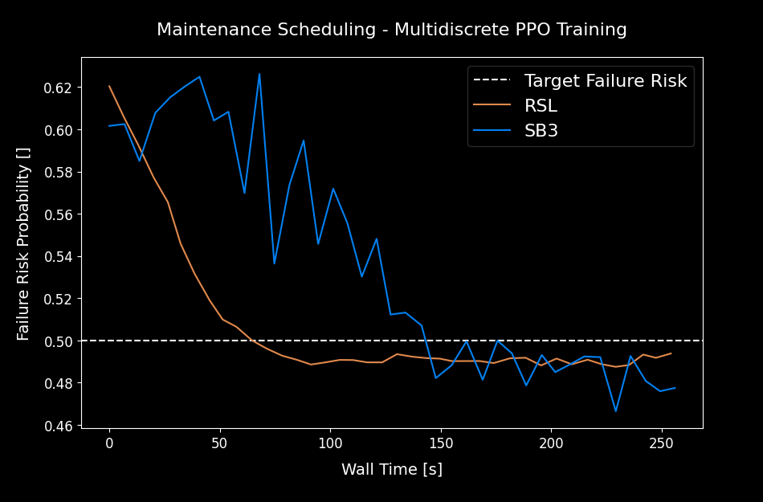

<table>
  <tr>
    <td width="50%"></td>
    <td width="50%"></td>
  </tr>
</table>

<p align="center">
<a href="https://alexpalms.github.io/projects/03-discrete_rsl_rl/"></a>
</p>

<p align="center">
<a href="https://github.com/alexpalms/discrete_rsl_rl/actions/workflows/code-checks.yaml"></a>
<a href="https://github.com/alexpalms/discrete_rsl_rl/actions/workflows/pytest.yaml"></a>

</p>

<p align="center">


</p>

# Discrete RSL RL

Customized version of the original [RSL RL project](https://github.com/leggedrobotics/rsl_rl) that additionally supports multi discrete action spaces, providing a fast and simple implementation of PPO algorithm, designed to run fully on GPU.

## Overview

### Motivation

RSL-RL is a lightweight, GPU-native RL library designed for fast, high-throughput continuous control, but it originally only supported continuous actions, limiting its applicability. Many real-world tasks, like maintenance scheduling or resource allocation, require **multi-discrete action spaces**, where the agent makes independent categorical choices per branch. This project extended RSL-RL to handle multi-discrete actions while preserving its continuous control performance, keeping API changes minimal, and validating results against Stable Baselines 3. With this update, RSL-RL can now tackle a broader range of decision-making and optimization problems, all while maintaining GPU-accelerated speed.

### Implementation Details

The core of this project was extending the RSL-RL codebase to natively support multi-discrete actions while keeping continuous control fully functional. You can see all the modifications in my [commit here](https://github.com/alexpalms/discrete_rsl_rl/commit/d9ccebe7fee536b574ea36dfd94c0f4ccde8c916?diff=split).

Here’s a high-level overview of the changes:

- **[Actor-Critic Module](https://github.com/alexpalms/discrete_rsl_rl/blob/main/rsl_rl/modules/actor_critic.py).** The `ActorCritic` class was refactored to handle both continuous and multi-discrete distributions. For continuous actions, it still outputs mean and standard deviation vectors. For multi-discrete actions, it now outputs concatenated logits per branch and manages sampling, evaluation, and log-probability calculations appropriately. This allows PPO and other algorithms to work seamlessly with either action type.

- **[Rollout Storage](https://github.com/alexpalms/discrete_rsl_rl/blob/main/rsl_rl/storage/rollout_storage.py).** Rollout storage was adapted to store logits for multi-discrete actions instead of continuous action vectors. This includes modifications to `add_transitions` and mini-batch generators to maintain a uniform interface for both types of action spaces. The storage still resides fully on GPU for maximum speed.

- **[PPO Runner](https://github.com/alexpalms/discrete_rsl_rl/blob/main/rsl_rl/runners/on_policy_runner.py).** The on-policy runner was updated to correctly initialize the algorithm with the proper shapes for multi-discrete actions. It now dynamically handles action type selection from the environment configuration without breaking the continuous action workflow.

Key Points:
- The implementation maintains **full GPU execution**, no matter if actions are continuous or multi-discrete.
- Continuous action benchmarks remain **unaffected**, ensuring no regressions.
- The API changes are minimal, keeping the library intuitive and easy to use.

These updates make RSL-RL more versatile, opening the door to a broader class of reinforcement learning problems without sacrificing speed or simplicity.

## Technical Details

Below are instructions to set up the environment, run training, and visualize results.

### Installation

- Install `uv` ([Ref](https://github.com/astral-sh/uv)) (E.g. `curl -LsSf https://astral.sh/uv/install.sh | sh`)
- Install package: `uv sync`

This ensures that all necessary libraries for RSL-RL, Stable Baselines 3, and GPU execution are available.

### Validation

We validate the multi-discrete and continuous implementations through training and evaluation on representative benchmarks, ensuring full GPU execution and no regressions on continuous tasks.

#### Multi Discrete Action Space - Maintenance Scheduling Optimization

- **Environment:** Custom maintenance scheduling optimization problem, where the agent decides which machine to service at each timestep over a 1-year simulation.
- **Action Space:** Multi-discrete choice.
- **Goal:** Test correctness and efficiency of multi-discrete support in RSL-RL.
- **Validation:** Compared performance and training curves with SB3’s multi-discrete PPO implementation.

Train agents:

```bash
uv run python training_rsl_multidiscrete.py # RSL Training
uv run python training_sb3_multidiscrete.py # Stable Baselines 3 Training
```

After training, evaluate the trained models:

```bash
uv run python evaluate_multidiscrete.py
```

Results are visualized below. On the left, you can see the training curves comparing RSL and SB3, while on the right is the evaluation of both trained model on the scheduling task.

<table>
  <tr>
    <td width="50%"></td>
    <td width="50%"></td>
  </tr>
  <tr>
    <td align="center">MultiDiscrete Training Curve RSL VS SB3</td>
    <td align="center">Trained Model Evaluation</td>
  </tr>
</table>

#### Continuous Action Space - Robotics Legged Locomotion

- **Environment:** Genesis simulator with a Unitree Go2 quadruped robot.
- **Action Space:**  Fully continuous joint controls.
- **Goal:** Evaluate if RSL-RL still matches or exceeds baseline performance in standard continuous locomotion tasks.
- **Validation:** Compared training curves with original RSL-RL results and evaluation runs with Stable Baselines 3 (SB3) using PPO.

Traing agents:

```bash
uv run python training_rsl_continuous.py # RSL Training
uv run python training_sb3_continuous.py # Stable Baselines 3 Training
```

Evaluate the trained models:

```bash
uv run python evaluate_continuous.py
```

The table below shows the learning curves (left) and evaluation of the Unitree Go2 locomotion task for both RSL and SB3 (center and right). RSL-RL maintains performance parity while running fully on GPU.

<table>
  <tr>
    <td width="33%"></td>
    <td width="33%"></td>
    <td width="33%"></td>
  </tr>
  <tr>
    <td width="33%" align="center">MultiDiscrete Training Curve RSL VS SB3</td>
    <td width="33%" align="center">Trained Model Evaluation - RSL</td>
    <td width="33%" align="center">Trained Model Evaluation - SB3</td>
  </tr>
</table>

#### Tensorboard Visualization

For interactive monitoring of training metrics, you can launch Tensorboard:

```bash
uv run tensorboard --logdir runs/
```

This will allow you to explore rewards, losses, and other key statistics in real-time.

To see the comparison of the main performance metrics between the two approaches, you can use the provided plot script:

```bash
uv run python runs/plot.py
```

## Citation
```
@misc{palmas2025discrete_rsl_rl,
  author = {Alessandro Palmas},
  title = {Discrete RSL RL},
  year = {2025},
  url = {https://github.com/alexpalms/discrete_rsl_rl},
  note = {GitHub repository}
}
```

__________________________________________________________________________

# RSL RL (Original Readme)

A fast and simple implementation of RL algorithms, designed to run fully on GPU.
This code is an evolution of `rl-pytorch` provided with NVIDIA's Isaac Gym.

Environment repositories using the framework:

* **`Isaac Lab`** (built on top of NVIDIA Isaac Sim): https://github.com/isaac-sim/IsaacLab
* **`Legged-Gym`** (built on top of NVIDIA Isaac Gym): https://leggedrobotics.github.io/legged_gym/

The main branch supports **PPO** and **Student-Teacher Distillation** with additional features from our research. These include:

* [Random Network Distillation (RND)](https://proceedings.mlr.press/v229/schwarke23a.html) - Encourages exploration by adding
  a curiosity driven intrinsic reward.
* [Symmetry-based Augmentation](https://arxiv.org/abs/2403.04359) - Makes the learned behaviors more symmetrical.

We welcome contributions from the community. Please check our contribution guidelines for more
information.

**Maintainer**: Mayank Mittal and Clemens Schwarke <br/>
**Affiliation**: Robotic Systems Lab, ETH Zurich & NVIDIA <br/>
**Contact**: cschwarke@ethz.ch

> **Note:** The `algorithms` branch supports additional algorithms (SAC, DDPG, DSAC, and more). However, it isn't currently actively maintained.


## Setup

The package can be installed via PyPI with:

```bash
pip install rsl-rl-lib
```

or by cloning this repository and installing it with:

```bash
git clone https://github.com/leggedrobotics/rsl_rl
cd rsl_rl
pip install -e .
```

The package supports the following logging frameworks which can be configured through `logger`:

* Tensorboard: https://www.tensorflow.org/tensorboard/
* Weights & Biases: https://wandb.ai/site
* Neptune: https://docs.neptune.ai/

For a demo configuration of PPO, please check the [example_config.yaml](config/example_config.yaml) file.


## Contribution Guidelines

For documentation, we adopt the [Google Style Guide](https://sphinxcontrib-napoleon.readthedocs.io/en/latest/example_google.html) for docstrings. Please make sure that your code is well-documented and follows the guidelines.

We use the following tools for maintaining code quality:

- [pre-commit](https://pre-commit.com/): Runs a list of formatters and linters over the codebase.
- [black](https://black.readthedocs.io/en/stable/): The uncompromising code formatter.
- [flake8](https://flake8.pycqa.org/en/latest/): A wrapper around PyFlakes, pycodestyle, and McCabe complexity checker.

Please check [here](https://pre-commit.com/#install) for instructions to set these up. To run over the entire repository, please execute the following command in the terminal:

```bash
# for installation (only once)
pre-commit install
# for running
pre-commit run --all-files
```

## Citing

**We are working on writing a white paper for this library.** Until then, please cite the following work
if you use this library for your research:

```text
@InProceedings{rudin2022learning,
  title = 	 {Learning to Walk in Minutes Using Massively Parallel Deep Reinforcement Learning},
  author =       {Rudin, Nikita and Hoeller, David and Reist, Philipp and Hutter, Marco},
  booktitle = 	 {Proceedings of the 5th Conference on Robot Learning},
  pages = 	 {91--100},
  year = 	 {2022},
  volume = 	 {164},
  series = 	 {Proceedings of Machine Learning Research},
  publisher =    {PMLR},
  url = 	 {https://proceedings.mlr.press/v164/rudin22a.html},
}
```

If you use the library with curiosity-driven exploration (random network distillation), please cite:

```text
@InProceedings{schwarke2023curiosity,
  title = 	 {Curiosity-Driven Learning of Joint Locomotion and Manipulation Tasks},
  author =       {Schwarke, Clemens and Klemm, Victor and Boon, Matthijs van der and Bjelonic, Marko and Hutter, Marco},
  booktitle = 	 {Proceedings of The 7th Conference on Robot Learning},
  pages = 	 {2594--2610},
  year = 	 {2023},
  volume = 	 {229},
  series = 	 {Proceedings of Machine Learning Research},
  publisher =    {PMLR},
  url = 	 {https://proceedings.mlr.press/v229/schwarke23a.html},
}
```

If you use the library with symmetry augmentation, please cite:

```text
@InProceedings{mittal2024symmetry,
  author={Mittal, Mayank and Rudin, Nikita and Klemm, Victor and Allshire, Arthur and Hutter, Marco},
  booktitle={2024 IEEE International Conference on Robotics and Automation (ICRA)},
  title={Symmetry Considerations for Learning Task Symmetric Robot Policies},
  year={2024},
  pages={7433-7439},
  doi={10.1109/ICRA57147.2024.10611493}
}
```
